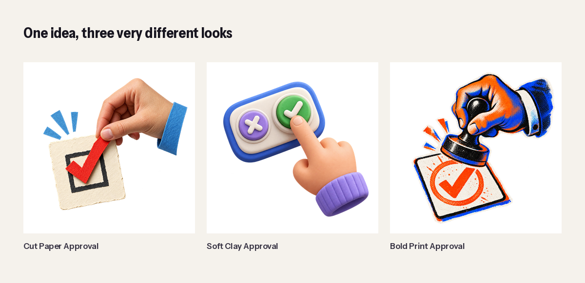

# Make Brand Assets For Me

Show it your brand. Tell it what you need. It helps you make assets that match.

**Free and open source. Built by [Lemonbrand](https://lemonbrand.io).**



## What this is

This is a small set of skills for an AI agent. You bring your own approved brand examples. The skills help the agent study them, ask only the questions that matter, make new visual assets, check the result, and save a useful record.

The package does not give everyone the same look. The example PNGs are only proof that one process can work across very different styles.

## The whole method

```text
SHOW → PLAN → MAKE → CHECK → SAVE
```

1. **Show:** Give the agent approved examples.
2. **Plan:** Say what the new asset must do.
3. **Make:** Reuse, change, combine, generate, or animate.
4. **Check:** Compare every important part with approved examples.
5. **Save:** Keep the file and a plain record of how it was made.

## Pick one skill

- **Set Up My Brand** turns your examples into a brand recipe.
- **Make One Brand Asset** makes one object with one clear job.
- **Make A Brand Scene** makes one picture with several parts and room for copy.
- **Make A Brand Asset Set** turns a method or framework into separate matching files.
- **Make A Brand Asset Move** adds small motion to approved artwork.
- **Make My Launch Pack** turns one approved idea into the profiles, banners, posts, stories, carousels, web graphics, email headers, video covers, copy, alt text, tracked links, and receipts needed for a launch.

## Install it

### Codex and ChatGPT desktop

Add the Lemonbrand marketplace:

```bash
codex plugin marketplace add Lemonbrand/make-brand-assets-for-me
```

Restart the ChatGPT desktop app. Open the Plugins Directory, choose **Lemonbrand**, and install **Make Brand Assets For Me**.

### Claude Code

Run these commands inside Claude Code:

```text
/plugin marketplace add Lemonbrand/make-brand-assets-for-me
/plugin install make-brand-assets-for-me@lemonbrand
```

### skills.sh and other Agent Skills hosts

```bash
npx skills add Lemonbrand/make-brand-assets-for-me
```

You can also download the newest ZIP from [GitHub Releases](https://github.com/Lemonbrand/make-brand-assets-for-me/releases).

## Try it

Read [Start Here](docs/start-here.md) for the complete first run.

Put a few approved brand examples in your project. Then say:

> Use Set Up My Brand to learn the look from these files.

Review the brand recipe. Then say:

> Make one transparent brand asset that means human approval.

Or make a whole campaign:

> Make my launch pack for this offer. Use this page and this one call to action.

The skills use the host's built-in ask-user function when a choice changes the result. If that function is unavailable, they ask one short question in normal chat.

## See the proof

- [Three styles](examples/gallery/proofs/01-three-styles.png)
- [Three scenes](examples/gallery/proofs/02-three-scenes.png)
- [One matching set](examples/gallery/proofs/03-one-matching-set.png)
- [All ten baselines](examples/gallery/proofs/04-all-baselines.png)
- [Complete worked launch pack](examples/launch-pack/lemonbrand/README.md)
- [Launch-pack contact sheet](examples/launch-pack/lemonbrand/proofs/contact-sheet.png)
- [Test results](docs/test-results.md)

## Check the package

```bash
python3 -m pip install -r requirements-dev.txt
pytest -q tests
python3 scripts/sync_shared_rules.py --check
python3 scripts/sync_distribution_skills.py --check
python3 scripts/check_package.py
python3 scripts/check_for_private_stuff.py
```

The package includes ten baseline PNGs, their briefs and receipts, a complete 30-file launch manifest, channel copy, proof sheets, screenshots, and reproducible release tooling.

## What is not inside

- no customer artwork;
- no private brand library;
- no hosted server;
- no image API client;
- no automatic upload or publishing;
- no promise that an asset is legally cleared for every use.

## Share and improve it

Use it, fork it, and adapt it under the [MIT License](LICENSE.md). Contributions are welcome. See [CONTRIBUTING.md](CONTRIBUTING.md).

## Your operations need more than a picture?

Lemonbrand is an AI operations partner. If your team's real bottleneck lives around the inbox, book a [free 60-minute Inbox Audit](https://lemonbrand.io/inbox-audit?utm_source=github&utm_medium=referral&utm_campaign=make_brand_assets_for_me). You will leave with one clear place to begin.

Version: `0.2.0`
